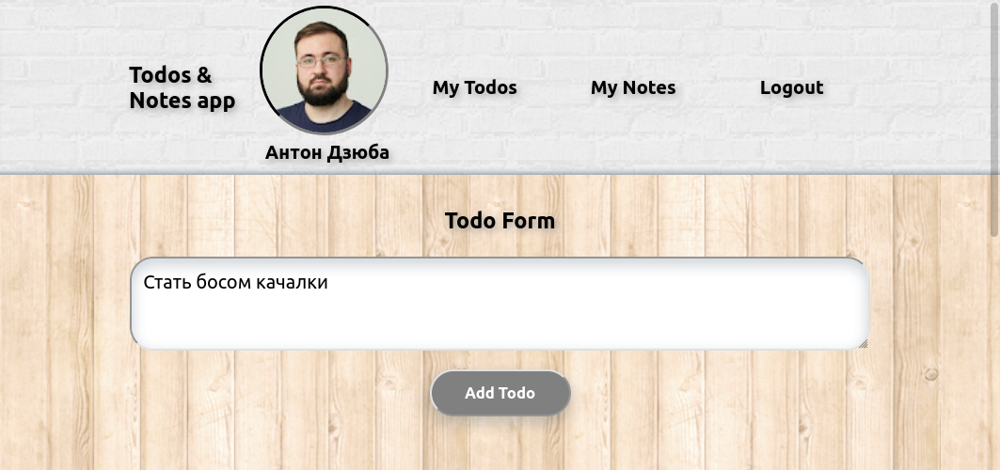

# Todos & Notes app

  
SPA web-приложение для планирования задач и ведения заметок
  

Использовать приложение очень просто!
<ol>
<li>Заходим на <a href="https://todos-and-notes.herokuapp.com">https://todos-and-notes.herokuapp.com<a/></li>

  
<li>Входим через Google аккаунт</li>

  
<li>Заполняем формы для создания задач и записей</li>

  
<li>Можем отмечать выполненные задачи и редактировать заметки</li>

</ol>
  

# Техгологии в проекте
  

  
  
  
  
  

Back-end:
Nodejs, Expressjs, Mongoose, MongoDB Atlas, Google oauth2.0, Cors, .env

  
  
  
  

  
Front-end:
React, Redux, Redux Thunk, Redux devtools, CSS
  

  

